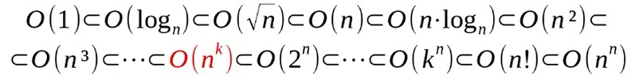
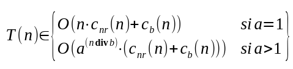

# Eficiencia de algoritmos y cuantificación
Implica estudio teórico comparativo independiente de implementación. 
Se trata de clasificar algoritmos en familias, y el estudio se reducirá a comparar las distintas familias.
El comportamiento se evalúa según crece la entrada, lo que se denomina asintótico.
La eficiencia se cuantifica según memoria, tiempo empleado, u otros aspectos (consumo de internet o electricidad). 
Si nos centramos en el tiempo, nos podemos fijar en el caso peor (el caso en el que el algoritmo es menos eficiente) o bien el caso mejor, lo opuesto. También el caso medio, es decir, el que se procesará más veces.
El caso peor fija una cota superior, es decir coste asintótico temporal peor.
El caso asintótico temporal peor se estudia con métricas de análisis

# Métricas de análisis y órdenes  de complejidad
La notación de Landau permite señalar el término dominante en una función. 
- O mayúscula, O grade, orden de n se defone como conjunto {g / g no crece más que f}.
- Omega de f, se define como conjunto {g / g crece al menos como f}
- Cota exacata se define como el conjunto {g / g crece exactamente como f}

La jerarquía de órdenes es la misma tomada en el cálculo de límites:

# Reglas prácticas para el cálculo del coste

## Algoritmos iterativos
Se debe definir el tamaño del problema
Se debe calcular el coste de cada instrucción

## Llamada a subprogramas
f(e_1, e_2, ..., e_n) será `max{O(C_e1), O(c_e2), O(c_en), O(c_f)}`

## Algoritmos recursivos
En los algoritmos recursivos, la función de coste también es recursiva:

`T(n) = k_1(n)` si `n` es caso base
`T(n) = a*T(n')+k_2(n)` si `n` no es caso base

Para resolver una recurrencia hanbrá que asignar una expresión no recursiva para T(n). Nos limitaremos a calcular a qué orden de complejidad pertenece T(n). Dos casos:
- Reducción mediante sustracción

- Reducción mediante división

## Operaciones de órdenes
### Operaciones básicas
No dependen del tamaño del problema. Operaciones de entrada/salida, asignación, y expresiones. El coste será constante, por lo que el orden será O(1)

### Composición
La composición secuencia de sentencias es la ejecución de varias sentencias ejecutadas secuencialmente. Para calcular su coste se calcula el coste de manera independiente, y después se suman los costes.

### Suma
La suma de órdenes se define como:
`O(f)+O(g) = O(f+g)`
Por tomar un ejemplo: `O(n^2)+O(n)=O(n^2+n)=O(n^2)`

### Producto
`O(g)*O(f)=O(g*f)`

## Sentencias 
### Condicionales
`if (e) {s1} else {s2}` se define como composición secuencia e;S1 ó e;S2 por lo que el coste máximo será `max{O(c_e), O(C_s1), O(C_s2)}`

### switch
switch se define como composición de secuencia e;S1; e;S2 e;S3 por lo que el coste será `max{O(C_e), O(C_s1), O(C_s2), ..., O(C_sn)}`

### Bucles
- for (ini;e;inc) {S} será `max{O(C_ini), O(v(n)*max{O(C_e), O(C_s), O(C_inc)})}`
- while (e) {S} para cada vuelta del bucle (v(n) vueltas): `O(v(n))*max{O(C_e), O(C_s)}`
- do {S} while (e): `O(v(n)*max{O(C_e), O(C_s)})`

