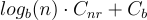
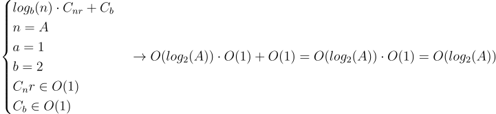

# Ejercicio 2
En primer lugar se debe definir el tamaño del problema. En este caso es A puesto que es el valor que determina alcanzar la sentencia no recursiva (``A==0``). La función recursiva contiene como sentencia más externa un condicional, por lo que el coste vendrá determinado por el coste asintótico temporal mayor de entre las comparaciones y los tres casos de ``return``. En este caso, puesto que se trantan de operaciones de entrada-salida, asignación y expresión, estamos hablando de operaciones de coste constante O(1) en todos los casos, por lo que el máximo del conjunto también será O(1).

Puesto que estamos ante una función recursiva y el valor de A disminuye por división, el orden de complejidad vendrá determinado por la expresión

 ,

asignando los siguientes valores:

