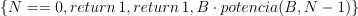
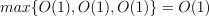
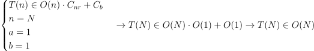

# Ejercicio 3
El tamaño n del problema será N. La función tiene como componente más externo una condición por lo que el coste máximo será el máximo de entre 

por lo que al tratarse de operaciones básicas, nos está pidiendo 

Puesto que N converge a la secuencia no recursiva por sustracción:

